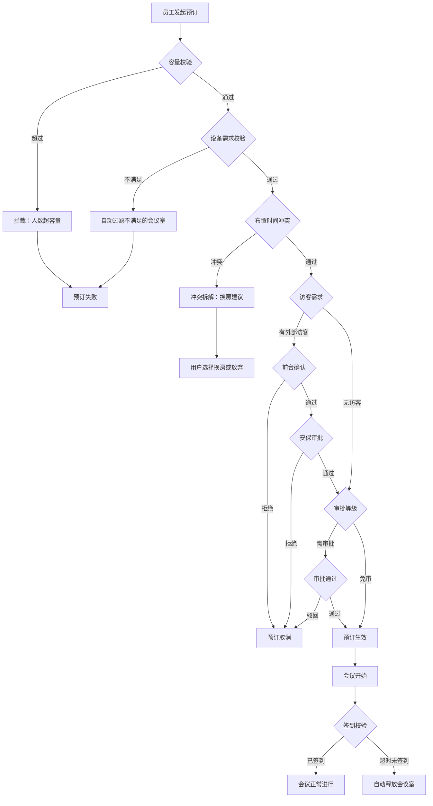

## 1. 产品概述

园区会议室资源、访客、设备与签到协同系统，面向行政、员工、前台、设备管理员四类角色，实现会议室预订全流程管控——从资源筛选、审批、访客确认到签到核销、设备借还和异常处理。系统通过本地流水记录推导所有状态，支持容器化部署和完整演示场景。

- 核心目标：消除会议室资源冲突、保障访客安全合规、实现设备全生命周期管理、自动处理预约异常
- 目标用户：园区行政人员、普通员工、前台接待、设备管理员

## 2. 核心功能

### 2.1 用户角色

| 角色 | 进入方式 | 核心权限 |
|------|----------|----------|
| 行政 | 登录选择角色 | 维护会议室容量/设备/开放时段/访客权限/审批规则/成本中心/VIP优先级 |
| 员工 | 登录选择角色 | 按条件发起预订、查看我的会议、签到、取消会议 |
| 前台 | 登录选择角色 | 访客接待确认、签到看板、当天占用查看、访客证件审核 |
| 设备管理员 | 登录选择角色 | 设备维修/借用/故障管理、故障影响预订提醒 |

### 2.2 功能模块

1. **日历总览页**：日历视图展示会议室占用、筛选资源、快速预订入口
2. **会议室预订页**：按人数/时间/设备/访客/等级发起预订、周期规则编辑、布置缓冲与茶歇
3. **访客管理页**：访客名单维护、证件审核、前台确认、安保审批
4. **签到看板页**：实时签到状态、超时自动释放、爽约记录
5. **设备管理页**：设备状态看板、维修登记、借用归还、故障影响分析
6. **审批与冲突页**：审批规则配置、冲突拆解、VIP抢占、临时换房建议
7. **成本中心页**：成本中心预算、会议成本分摊、预算预警

### 2.3 页面详情

| 页面名称 | 模块名称 | 功能描述 |
|----------|----------|----------|
| 日历总览 | 日历视图 | 按日/周/月展示会议室占用，颜色区分会议等级和状态 |
| 日历总览 | 资源筛选器 | 按容量/设备/楼层/时段/成本中心筛选可用会议室 |
| 日历总览 | 快速预订浮层 | 点击空闲时段快速发起预订 |
| 会议室预订 | 预订表单 | 人数/时间/设备/访客需求/会议等级/混合设备需求 |
| 会议室预订 | 周期规则编辑 | 按周/双周/月设置重复规则，可视化预览周期实例 |
| 会议室预订 | 布置与茶歇 | 设置布置缓冲时间、茶歇需求及时间段 |
| 会议室预订 | 参会名单 | 大型会议（>10人）强制填写参会名单 |
| 会议室预订 | 冲突提示 | 实时检测布置时间/设备维修/访客确认/审批等级冲突 |
| 访客管理 | 访客名单 | 维护外部访客信息、证件类型、来访事由 |
| 访客管理 | 证件审核 | 前台审核访客证件，通过/驳回 |
| 访客管理 | 前台确认 | 外部访客会议必须前台确认后方可生效 |
| 访客管理 | 安保审批 | 高等级访客需安保审批 |
| 签到看板 | 签到状态 | 实时展示会议签到情况，已签到/未签到/超时 |
| 签到看板 | 超时释放 | 未签到超时（可配置）自动释放会议室 |
| 签到看板 | 爽约记录 | 记录爽约次数，多次爽约限制预订 |
| 设备管理 | 设备状态看板 | 展示所有设备当前状态（正常/维修中/借出/故障） |
| 设备管理 | 维修登记 | 登记设备维修，维修中设备所在会议室不可预约 |
| 设备管理 | 借用归还 | 设备借用申请与归还确认 |
| 设备管理 | 故障影响 | 设备故障自动检测受影响预订，生成提醒和换房建议 |
| 审批与冲突 | 审批规则 | 按会议等级/访客类型/成本中心配置审批流 |
| 审批与冲突 | 冲突拆解 | 展示冲突详情（布置时间/设备/访客/审批/预算），提供解决方案 |
| 审批与冲突 | VIP抢占 | VIP优先级会议可抢占普通会议，被抢占会议自动换房 |
| 审批与冲突 | 临时换房 | 冲突时推荐可用替代会议室 |
| 审批与冲突 | 会议室组合拆分 | 大会议室可拆分为小会议室使用 |
| 成本中心 | 成本预算 | 各成本中心预算设置与余额查询 |
| 成本中心 | 成本分摊 | 会议费用按成本中心分摊，超预算拦截 |
| 成本中心 | 费用报表 | 成本中心使用统计与趋势 |

## 3. 核心流程

### 3.1 预订流程
员工发起预订 → 系统校验（容量/设备/时段/布置/访客/审批/预算）→ 冲突检测 → 审批流（如需）→ 外部访客需前台确认 → 高等级访客需安保审批 → 预订生效 → 日历更新

### 3.2 签到与释放流程
会议开始 → 签到开放 → 员工签到 → 超时未签到 → 自动释放会议室+设备 → 记录爽约

### 3.3 设备故障处理流程
设备故障报告 → 标记维修中 → 扫描受影响预订 → 生成提醒通知 → 提供换房建议 → 预订迁移或取消

## 4. 用户界面设计

### 4.1 设计风格
- 主色调：深青色(#0F766E) + 琥珀色(#D97706)强调色，搭配暖灰底色
- 按钮风格：圆角(8px) + 微阴影，主按钮实色，次按钮描边
- 字体：Noto Sans SC(正文) + DM Sans(数字/英文)
- 布局风格：左侧导航 + 顶部面包屑 + 卡片式内容区
- 图标风格：Lucide 线性图标
- 整体风格：现代商务、清爽高效、信息密度适中

### 4.2 页面设计概述

| 页面名称 | 模块名称 | UI元素 |
|----------|----------|--------|
| 日历总览 | 日历视图 | 月历网格、时段色块、悬浮卡片、拖拽选择 |
| 日历总览 | 筛选器 | 侧栏抽屉、多选标签、滑块(容量/时间)、徽章计数 |
| 会议室预订 | 表单 | 分步表单、自动补全、级联选择、实时冲突提示 |
| 会议室预订 | 周期编辑 | 日历热力图、规则卡片、实例预览列表 |
| 访客管理 | 名单表格 | 可编辑表格、证件上传区、审核操作栏 |
| 签到看板 | 状态卡片 | 大屏卡片、倒计时、签到按钮、释放动画 |
| 设备管理 | 看板 | 状态泳道、拖拽排序、维修进度条 |
| 审批与冲突 | 冲突面板 | 时间线冲突图、解决方案卡片、优先级标签 |
| 成本中心 | 图表 | 饼图/柱图、预算进度条、预警提示 |

### 4.3 响应式设计
- 桌面优先（1920/1440/1280px），平板适配（768px），手机基础可用（375px）
- 日历视图在移动端切换为列表模式
- 签到看板支持大屏投屏模式

## 5. 演示场景

系统启动后需支持以下演示场景：
1. **周期冲突演示**：创建周期会议，展示与已有预订的时间冲突
2. **VIP抢占演示**：VIP等级会议抢占普通会议，自动换房
3. **设备故障迁移演示**：标记设备故障，受影响预订自动迁移
4. **未签到释放演示**：会议超时未签到，自动释放会议室
5. **访客未确认拦截演示**：外部访客会议未获前台确认，预订被拦截
