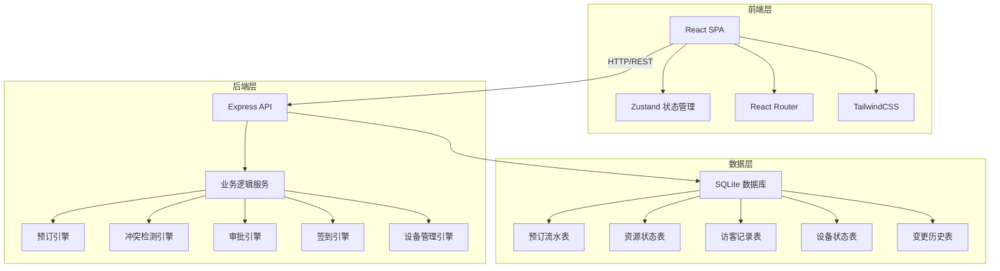
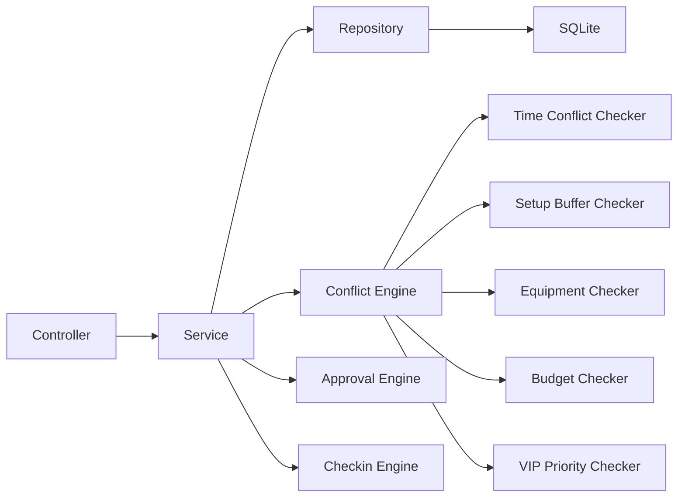
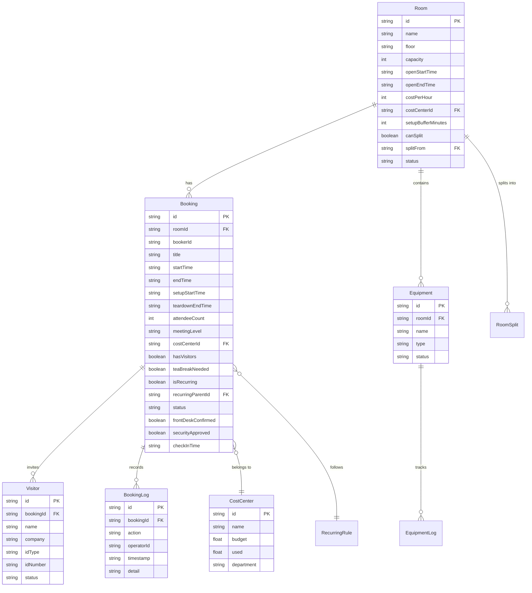

## 1. 架构设计



## 2. 技术说明

- 前端：React@18 + TypeScript + TailwindCSS@3 + Vite + Zustand
- 初始化工具：vite-init (react-express-ts 模板)
- 后端：Express@4 + TypeScript (ESM)
- 数据库：SQLite3（本地文件，容器友好）
- 图标：lucide-react
- 日期处理：date-fns
- 图表：recharts

## 3. 路由定义

| 路由 | 用途 |
|------|------|
| `/` | 日历总览页（默认首页） |
| `/booking` | 会议室预订页 |
| `/booking/:id` | 预订详情页 |
| `/visitors` | 访客管理页 |
| `/checkin` | 签到看板页 |
| `/equipment` | 设备管理页 |
| `/conflict` | 审批与冲突页 |
| `/cost` | 成本中心页 |

## 4. API 定义

### 4.1 会议室 API
- `GET /api/rooms` - 获取会议室列表（支持筛选）
- `GET /api/rooms/:id` - 获取会议室详情
- `POST /api/rooms` - 创建会议室（行政）
- `PUT /api/rooms/:id` - 更新会议室（行政）
- `GET /api/rooms/:id/availability` - 获取可用时段

### 4.2 预订 API
- `GET /api/bookings` - 获取预订列表（支持日期/会议室/状态筛选）
- `GET /api/bookings/:id` - 获取预订详情
- `POST /api/bookings` - 创建预订（含冲突检测）
- `PUT /api/bookings/:id` - 更新预订
- `DELETE /api/bookings/:id` - 取消预订（释放资源）
- `POST /api/bookings/:id/checkin` - 签到
- `POST /api/bookings/:id/confirm` - 前台确认
- `POST /api/bookings/:id/approve` - 审批操作
- `POST /api/bookings/swap-room` - 临时换房

### 4.3 访客 API
- `GET /api/visitors` - 获取访客列表
- `POST /api/visitors` - 登记访客
- `PUT /api/visitors/:id` - 更新访客信息
- `POST /api/visitors/:id/verify-id` - 证件审核
- `POST /api/visitors/:id/security-approve` - 安保审批

### 4.4 设备 API
- `GET /api/equipment` - 获取设备列表
- `POST /api/equipment` - 创建设备
- `PUT /api/equipment/:id` - 更新设备
- `POST /api/equipment/:id/maintenance` - 登记维修
- `POST /api/equipment/:id/return` - 归还设备
- `POST /api/equipment/:id/borrow` - 借用设备
- `GET /api/equipment/:id/affected-bookings` - 故障影响预订

### 4.5 成本中心 API
- `GET /api/cost-centers` - 获取成本中心列表
- `POST /api/cost-centers` - 创建成本中心
- `PUT /api/cost-centers/:id` - 更新成本中心
- `GET /api/cost-centers/:id/budget` - 获取预算余额

### 4.6 系统配置 API
- `GET /api/config/rules` - 获取审批规则
- `POST /api/config/rules` - 创建审批规则
- `GET /api/config/rooms-split` - 获取会议室组合拆分配置

### 4.7 数据类型定义

```typescript
interface Room {
  id: string;
  name: string;
  floor: string;
  capacity: number;
  equipmentIds: string[];
  openStartTime: string;
  openEndTime: string;
  costPerHour: number;
  costCenterId: string;
  canSplit: boolean;
  splitFrom?: string;
  setupBufferMinutes: number;
  status: 'available' | 'maintenance' | 'closed';
}

interface Booking {
  id: string;
  roomId: string;
  bookerId: string;
  title: string;
  startTime: string;
  endTime: string;
  setupStartTime?: string;
  teardownEndTime?: string;
  attendeeCount: number;
  attendeeList?: string[];
  meetingLevel: 'normal' | 'important' | 'vip';
  costCenterId: string;
  hasVisitors: boolean;
  visitorIds: string[];
  equipmentIds: string[];
  teaBreakNeeded: boolean;
  teaBreakTime?: string;
  isRecurring: boolean;
  recurringRule?: RecurringRule;
  recurringParentId?: string;
  status: 'pending' | 'confirmed' | 'checking' | 'approved' | 'rejected' | 'cancelled' | 'completed' | 'no_show';
  frontDeskConfirmed: boolean;
  securityApproved: boolean;
  checkInTime?: string;
  releasedAt?: string;
  swapHistory?: SwapRecord[];
}

interface RecurringRule {
  frequency: 'weekly' | 'biweekly' | 'monthly';
  dayOfWeek?: number[];
  dayOfMonth?: number;
  endDate: string;
}

interface Visitor {
  id: string;
  name: string;
  company: string;
  idType: string;
  idNumber: string;
  purpose: string;
  bookingId: string;
  status: 'registered' | 'id_verified' | 'security_approved' | 'checked_in' | 'left';
  photoUrl?: string;
}

interface Equipment {
  id: string;
  name: string;
  type: string;
  roomId?: string;
  status: 'normal' | 'maintenance' | 'borrowed' | 'faulty';
  maintenanceNote?: string;
  expectedReturnDate?: string;
  borrowerId?: string;
}

interface CostCenter {
  id: string;
  name: string;
  budget: number;
  used: number;
  department: string;
}

interface BookingLog {
  id: string;
  bookingId: string;
  action: 'created' | 'updated' | 'cancelled' | 'approved' | 'rejected' | 'checkin' | 'released' | 'swapped' | 'confirmed' | 'security_approved' | 'id_verified';
  operatorId: string;
  timestamp: string;
  detail: string;
}
```

## 5. 服务端架构图



## 6. 数据模型

### 6.1 数据模型定义



### 6.2 DDL 语句

```sql
CREATE TABLE rooms (
  id TEXT PRIMARY KEY,
  name TEXT NOT NULL,
  floor TEXT NOT NULL,
  capacity INTEGER NOT NULL,
  open_start_time TEXT NOT NULL,
  open_end_time TEXT NOT NULL,
  cost_per_hour REAL DEFAULT 0,
  cost_center_id TEXT,
  setup_buffer_minutes INTEGER DEFAULT 15,
  can_split INTEGER DEFAULT 0,
  split_from TEXT,
  status TEXT DEFAULT 'available',
  created_at TEXT DEFAULT (datetime('now')),
  updated_at TEXT DEFAULT (datetime('now'))
);

CREATE TABLE room_equipment (
  room_id TEXT NOT NULL,
  equipment_id TEXT NOT NULL,
  PRIMARY KEY (room_id, equipment_id)
);

CREATE TABLE bookings (
  id TEXT PRIMARY KEY,
  room_id TEXT NOT NULL,
  booker_id TEXT NOT NULL,
  title TEXT NOT NULL,
  start_time TEXT NOT NULL,
  end_time TEXT NOT NULL,
  setup_start_time TEXT,
  teardown_end_time TEXT,
  attendee_count INTEGER NOT NULL,
  attendee_list TEXT,
  meeting_level TEXT DEFAULT 'normal',
  cost_center_id TEXT,
  has_visitors INTEGER DEFAULT 0,
  tea_break_needed INTEGER DEFAULT 0,
  tea_break_time TEXT,
  is_recurring INTEGER DEFAULT 0,
  recurring_parent_id TEXT,
  status TEXT DEFAULT 'pending',
  front_desk_confirmed INTEGER DEFAULT 0,
  security_approved INTEGER DEFAULT 0,
  check_in_time TEXT,
  released_at TEXT,
  created_at TEXT DEFAULT (datetime('now')),
  updated_at TEXT DEFAULT (datetime('now')),
  FOREIGN KEY (room_id) REFERENCES rooms(id),
  FOREIGN KEY (cost_center_id) REFERENCES cost_centers(id)
);

CREATE TABLE booking_equipment (
  booking_id TEXT NOT NULL,
  equipment_id TEXT NOT NULL,
  PRIMARY KEY (booking_id, equipment_id)
);

CREATE TABLE visitors (
  id TEXT PRIMARY KEY,
  booking_id TEXT NOT NULL,
  name TEXT NOT NULL,
  company TEXT,
  id_type TEXT,
  id_number TEXT,
  purpose TEXT,
  status TEXT DEFAULT 'registered',
  photo_url TEXT,
  created_at TEXT DEFAULT (datetime('now')),
  FOREIGN KEY (booking_id) REFERENCES bookings(id)
);

CREATE TABLE equipment (
  id TEXT PRIMARY KEY,
  name TEXT NOT NULL,
  type TEXT NOT NULL,
  room_id TEXT,
  status TEXT DEFAULT 'normal',
  maintenance_note TEXT,
  expected_return_date TEXT,
  borrower_id TEXT,
  created_at TEXT DEFAULT (datetime('now')),
  updated_at TEXT DEFAULT (datetime('now'))
);

CREATE TABLE cost_centers (
  id TEXT PRIMARY KEY,
  name TEXT NOT NULL,
  budget REAL NOT NULL DEFAULT 0,
  used REAL NOT NULL DEFAULT 0,
  department TEXT,
  created_at TEXT DEFAULT (datetime('now'))
);

CREATE TABLE recurring_rules (
  id TEXT PRIMARY KEY,
  booking_id TEXT NOT NULL,
  frequency TEXT NOT NULL,
  day_of_week TEXT,
  day_of_month TEXT,
  end_date TEXT NOT NULL,
  created_at TEXT DEFAULT (datetime('now')),
  FOREIGN KEY (booking_id) REFERENCES bookings(id)
);

CREATE TABLE booking_logs (
  id TEXT PRIMARY KEY,
  booking_id TEXT NOT NULL,
  action TEXT NOT NULL,
  operator_id TEXT NOT NULL,
  timestamp TEXT DEFAULT (datetime('now')),
  detail TEXT,
  FOREIGN KEY (booking_id) REFERENCES bookings(id)
);

CREATE TABLE equipment_logs (
  id TEXT PRIMARY KEY,
  equipment_id TEXT NOT NULL,
  action TEXT NOT NULL,
  operator_id TEXT NOT NULL,
  timestamp TEXT DEFAULT (datetime('now')),
  detail TEXT,
  FOREIGN KEY (equipment_id) REFERENCES equipment(id)
);

CREATE TABLE approval_rules (
  id TEXT PRIMARY KEY,
  meeting_level TEXT,
  has_visitor INTEGER,
  cost_center_id TEXT,
  requires_approval INTEGER DEFAULT 1,
  requires_front_desk INTEGER DEFAULT 0,
  requires_security INTEGER DEFAULT 0,
  approver_id TEXT,
  created_at TEXT DEFAULT (datetime('now'))
);

CREATE TABLE swap_history (
  id TEXT PRIMARY KEY,
  booking_id TEXT NOT NULL,
  from_room_id TEXT NOT NULL,
  to_room_id TEXT NOT NULL,
  reason TEXT,
  operator_id TEXT NOT NULL,
  timestamp TEXT DEFAULT (datetime('now'))
);

CREATE TABLE users (
  id TEXT PRIMARY KEY,
  name TEXT NOT NULL,
  role TEXT NOT NULL,
  department TEXT,
  no_show_count INTEGER DEFAULT 0
);

CREATE INDEX idx_bookings_room_time ON bookings(room_id, start_time, end_time);
CREATE INDEX idx_bookings_status ON bookings(status);
CREATE INDEX idx_bookings_booker ON bookings(booker_id);
CREATE INDEX idx_bookings_recurring ON bookings(recurring_parent_id);
CREATE INDEX idx_visitors_booking ON visitors(booking_id);
CREATE INDEX idx_equipment_status ON equipment(status);
CREATE INDEX idx_booking_logs_booking ON booking_logs(booking_id);
```
